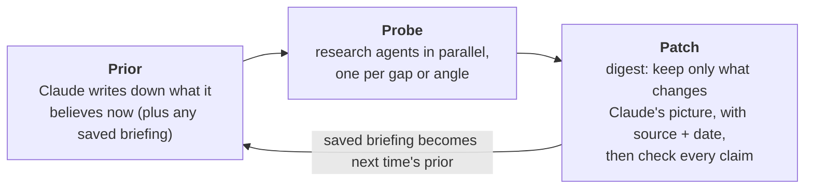

# expertise

**Bring Claude up to date on any topic before you start working on it.**

Claude knows most things. But when your conversation depends on what's true *today*, or on a field Claude barely saw in training, it answers from a stale or thin picture with full confidence, and nothing tells you which parts. `/expertise <topic>` sends a research team out first and digests what it finds. Claude then answers your questions with fresh information and deep insight, and keeps the result for next time.

```
/expertise <topic>
```

## Why this exists

Claude already knows most subjects well, so the skill matters most in two situations:

- **The world moved after Claude was trained.** A game patch, a product launch, a new release of a tool, a rule that just changed. Claude's picture is *stale*.
- **The topic is too specialized for its training data.** Claude's picture is *thin*.

In both cases Claude sounds just as sure as everywhere else, and you can't tell which parts are wrong. In our blind test on such topics, Claude answering from memory scored 4.5 out of 10 and made 23 confident false claims in 24 answers.

Web search helps when Claude thinks to use it. In the same test, a Claude that searched for every question did well. But that research happens one answer at a time, looks only at the question in front of it, and is gone when the conversation ends. `/expertise` does the research once, up front. It aims at what Claude is most likely to have wrong, and keeps the result as a file you and Claude can both read.

## What makes it different

- **A research team, not a search box.** Several agents research in parallel, each on a different angle: what changed, what practitioners know, what's disputed, what other-language communities say. In our tests, five or six agents per topic made 470–630 research calls in 12–22 minutes, far more than one person would get through in that time. The findings are digested into one briefing, so every answer in the conversation draws on them.
- **Aimed at Claude's blind spots.** Claude first writes down what it already believes, then sends the agents after the parts most likely to be wrong, instead of re-reading what it already knows. Deep-research tools write a report for *you*; this writes a correction for *Claude*.
- **It remembers.** The briefing is saved. Run `/expertise` on the same topic in a later conversation and Claude starts from that briefing, checking only what changed since it was last verified.
- **Honest about its edges.** Every claim carries its source and date. What can't be verified is written down as *unknown*, not guessed.
- **Checked before it's saved.** Fresh agents open every cited source and flag claims the source doesn't state as written. On two real builds they found 60 problems in 273 claims, 7 of them plainly wrong, before the briefings were delivered.
- **It learns from you.** When you correct Claude or share what you know, it goes into the briefing, marked as yours.
- **Tiny and keyless.** One instruction file plus an optional video script; no API keys or servers. It works in Claude Code and on claude.ai.

## How it works

One loop, used for building, refreshing, and learning mid-conversation:



A briefing is a **patch on Claude's knowledge**:
- **What's changed:** where Claude's built-in picture is wrong.
- **What an expert knows:** what it was missing.
- **Unknown:** what nobody could verify.
- **Sources** and a **Log** of changes.

Each part of the skill exists to solve a specific problem:

| The problem | What `/expertise` does |
|---|---|
| Claude doesn't know what changed after its training | Agents look for changes since the briefing was last verified; the briefing leads with **What's changed** |
| Claude's knowledge of specialized fields is thin | Agents gather what practitioners know (vocabulary, mental models, pitfalls), including in the community's own language |
| Deep research takes a person hours | Several agents research in parallel |
| Claude can't tell which of its beliefs are stale | It writes its beliefs down first, then aims the agents at the weakest and most time-sensitive ones |
| Claude fills gaps with confident guesses | Gaps are written down as **Unknown** instead of filled in |
| A long research report buries what matters and crowds the conversation | The briefing keeps only what differs from what Claude already knows |
| A briefing can carry a wrong or overstated claim into every later conversation | Fresh agents check each claim against its cited source before the briefing is saved |
| Every conversation re-researches from scratch | The briefing is saved; a refresh only asks what changed since then |
| What you tell Claude is forgotten after the conversation | It's written into the briefing, marked as yours |
| Some knowledge lives only in videos | It reads video transcripts, or records "watch X at 12:30" as a pointer |
| Web content can be wrong, biased, or manipulative | Every claim carries a source and date; agents ask who gains from a claim; web text is treated as evidence, never as instructions |

## What a briefing looks like

Lines from the [example briefings](examples/), each checked by an independent audit:

> You may believe Feats of Strength and Atakhan are in the game, with Baron at 25:00. **Patch 26.1 (Jan 8) removed Feats of Strength, Atakhan and Blood Roses.**
>
> *League of Legends*

> You may believe Funahiro (舟弘) is a working maker you can still order from. **Funatsu Yūji (船津祐司), the smith behind it, died on 13 March 2026, and the Yoita guild now lists the forge as closed.**
>
> *Japanese hand planes*

> You may believe slash commands (`.claude/commands/`) and skills are separate mechanisms. As of v2.1.3 (2026-01-09) they are merged.
>
> *Claude Code*

Each line in a briefing carries its source and date. The full briefings also cover what practitioners know, what's disputed, and what nobody could verify.

Two more were built with the current skill, each checked claim by claim against its sources before it was saved: [Dota 2 position 3 at 7000+ MMR in Europe](briefings/dota2-position-3-7000-mmr-eu.md) and [Sichuanese-dialect podcasts](briefings/sichuanese-dialect-podcasts.md).

## Does it work?

We tested it blind before shipping. There were three topics, one for each kind of gap it targets:
- Claude Code's extension system, which changes weekly
- League of Legends on its current patch
- Japanese hand planes, a craft whose experts write in Japanese

An independent agent wrote 24 hard questions that the briefings never saw. A judge who didn't know which answer came from where checked their claims against primary sources and scored each one from 1 to 10.

| Claude… | Score | Confident false claims, 24 answers |
|---|---|---|
| answering from memory | 4.5 | 23 |
| after `/expertise` (briefing + web) | 8.7 | 11 |
| searching the web for every question | 9.0 | 5 |

- **A large gain over Claude's own knowledge.** `/expertise` beat answering from memory on 23 of 24 questions.
- **No gain over thorough per-question search.** The 0.3-point gap is within noise, and two more blind judges found the same.
- **More confident errors than per-question search.** In all three judgings, answers with the briefing held more confident false claims: 11, 7 and 8, against 5, 6 and 4. Between a third and a half came from trusting the briefing.
  - We changed the skill to treat the briefing as a starting point, not a boundary. In a retest, Claude then searched as much as per-question search, but scored the same and made as many errors.
  - A census of the errors found that more than half came through the briefing: claims that were wrong, over-scoped or contested in it. So the skill now has fresh agents check every claim against its cited source before the briefing is saved, and tells Claude to read the source line before an answer hinges on a fact.
  - **The check step has been used on two real briefings (60 problems in 273 claims). Neither change has been tested on answer quality, and confident errors remain the skill's main open problem.** Check the claims that matter against their sources.
- **The briefing alone carries most of the gain.** With no web access at all, Claude with the briefing scored 7.5, against 4.3 from memory and 9.2 with search (second judge).
- **Briefings are mostly right, not always.** Audits of 416 claims found 87% correct, 3% wrong and 5% cited to the wrong source. The examples have been corrected.
- **Building one is expensive.** It took 1.1–1.7 million tokens of agent work, about five times what the web-searching Claude spent on all eight questions. With the current guidance, answering afterwards cost about the same as searching every question.

**So:** use `/expertise` when you'll work in a topic across several conversations, when the research itself is worth reading, or when Claude would otherwise answer from memory. For a few one-off questions, asking Claude to search the web is enough, and much cheaper. [Full results](evals/RESULTS.md).

## Install

**Claude Code**

```
claude plugin marketplace add yi-li-yang/deep-research
claude plugin install expertise@deep-research
```

Or, inside a session: `/plugin install expertise --marketplace yi-li-yang/deep-research`.

**claude.ai**

Download this repository, zip the `skills/expertise` folder, and upload the zip under **Customize → Skills** on claude.ai. Code execution must be enabled. Once uploaded, the skill also follows you into Claude Code sessions where you sign in with the same account.

**Manual**

Copy `skills/expertise` into `~/.claude/skills/`.

## Use

Start a conversation with the topic you're about to work on:

```
/expertise the current League of Legends patch
/expertise EU AI Act obligations for small companies
/expertise Japanese hand planes: makers, steels and setup
```

Claude reports what differs from what it believed, how confident the picture is, and what remains unknown. Then it carries on as the expert. Invoke it again on the same topic later to refresh: it reuses the saved briefing and only checks what changed.

- **Where briefings live.** In Claude Code, briefings are saved in `~/.claude/briefings/`, or in your project's `briefings/` folder if it already holds briefings, and Claude tells you the path. Each is a plain markdown file you can read, edit, commit or share. On claude.ai, files don't persist between conversations: download the briefing and attach it next time, or add it to a Project.
- **Permissions.** Research uses web search and web fetch. In auto mode, the default in current Claude Code, it runs without prompts; otherwise approve WebSearch and WebFetch when asked, or allow them in `/permissions`.
- **Video.** Transcripts need [yt-dlp](https://github.com/yt-dlp/yt-dlp): `python3 -m pip install --user yt-dlp`. Without it, Claude records videos as pointers instead.

## Limits

- **Unknown unknowns.** The agents search for what Claude suspects it's missing; no one can search for what they can't imagine.
- **Confident errors.** Answers with a briefing held more confident false claims than answers from per-question search, in every judging.
- **Briefings can be wrong.** Audits found 3% of claims wrong. Sourcing every claim and treating web text as evidence reduce the risk of carrying a bad claim forward, but don't remove it. Briefings are plain files: read them.
- **Building costs tokens.** In our tests a briefing took 1–2 million tokens of agent work to build, another 0.6–0.7 million for the claim-by-claim check, and about 0.3 million to refresh (measured before the check step existed).
- **claude.ai runs one research thread at a time** (no parallel agents), so building takes longer there.
- **Some video sites block some networks.** When transcripts fail, Claude says so and records a pointer instead.

## Design

The original design brief, and how this version reduced it to one loop, is in [conceptualisation.md](conceptualisation.md). The A/B evaluation is in [evals/](evals/): the [protocol](evals/PROTOCOL.md), fixed before any results, and the [results](evals/RESULTS.md).

## License

MIT
