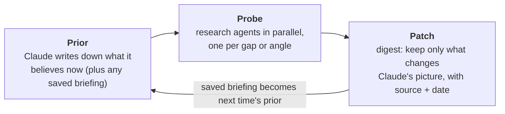

# expertise

**Bring Claude up to date on any topic before you start working on it.**

Claude knows most things. But when your conversation depends on what's true *today*, or on a field Claude barely saw in training, it answers from a stale or thin picture with full confidence, and nothing tells you which parts. `/expertise <topic>` sends a research team out first and digests what it finds. Claude then answers your questions with fresh information and deep insight, and keeps the result for next time.

```
/expertise <topic>
```

## Why this exists

Claude already knows most subjects well, so the skill matters most in two situations:

- **The world moved after Claude was trained.** A game patch, a product launch, a new release of a tool, a rule that just changed. Claude's picture is *stale*.
- **The topic is too specialized for its training data.** Claude's picture is *thin*.

In both cases Claude sounds just as sure as everywhere else, and you can't tell which parts are wrong.

Searching the web as each question comes up only partly fixes this. Every answer re-searches from scratch, skims whatever ranks first, and forgets it afterwards. And it never asks which of Claude's *own* beliefs are out of date.

## What makes it different

- **A research team, not a search box.** Several agents research in parallel, each on a different angle: what changed, what practitioners know, what's disputed, what other-language communities say. They cover in minutes what would take you hours, and go deeper than a single search. The findings are digested into one briefing, so every answer in the conversation draws on them.
- **Aimed at Claude's blind spots.** Claude first writes down what it already believes, then sends the agents after the parts most likely to be wrong, instead of re-reading what it already knows. Deep-research tools write a report for *you*; this writes a correction for *Claude*.
- **It remembers.** The briefing is saved. Run `/expertise` on the same topic in a later conversation and Claude starts from that briefing, checking only what changed since it was last verified.
- **Honest about its edges.** Every claim carries its source and date. What can't be verified is written down as *unknown*, so Claude stops guessing there.
- **It learns from you.** When you correct Claude or share what you know, it goes into the briefing, marked as yours.
- **Tiny and keyless.** One instruction file plus an optional video script; no API keys or servers. It works in Claude Code and on claude.ai.

## How it works

One loop, used for building, refreshing, and learning mid-conversation:



A briefing is a **patch on Claude's knowledge**:
- **What's changed:** where Claude's built-in picture is wrong.
- **What an expert knows:** what it was missing.
- **Unknown:** what nobody could verify.
- **Sources** and a **Log** of changes.

Each part of the skill exists to solve a specific problem:

| The problem | What `/expertise` does |
|---|---|
| Claude doesn't know what changed after its training | Agents look for changes since the briefing was last verified; the briefing leads with **What's changed** |
| Claude's knowledge of specialized fields is thin | Agents gather what practitioners know (vocabulary, mental models, pitfalls), including in the community's own language |
| Deep research takes a person hours | Several agents research in parallel |
| Claude can't tell which of its beliefs are stale | It writes its beliefs down first, then aims the agents at the weakest and most time-sensitive ones |
| Claude fills gaps with confident guesses | Gaps are written down as **Unknown**, so Claude stops guessing there |
| A long research report buries what matters and crowds the conversation | The briefing keeps only what differs from what Claude already knows |
| Every conversation re-researches from scratch | The briefing is saved; a refresh only asks what changed since then |
| What you tell Claude is forgotten after the conversation | It's written into the briefing, marked as yours |
| Some knowledge lives only in videos | It reads video transcripts, or records "watch X at 12:30" as a pointer |
| Web content can be wrong, biased, or manipulative | Every claim carries a source and date; agents ask who gains from a claim; web text is treated as evidence, never as instructions |

## Install

**Claude Code**

```
claude plugin marketplace add yi-li-yang/deep-research
claude plugin install expertise@deep-research
```

Or, inside a session: `/plugin install expertise --marketplace yi-li-yang/deep-research`.

**claude.ai**

Download this repository, zip the `skills/expertise` folder, and upload the zip under **Customize → Skills** on claude.ai. Code execution must be enabled. Once uploaded, the skill also follows you into Claude Code sessions where you sign in with the same account.

**Manual**

Copy `skills/expertise` into `~/.claude/skills/`.

## Use

Start a conversation with the topic you're about to work on:

```
/expertise the current League of Legends patch
/expertise EU AI Act obligations for small companies
/expertise Japanese hand planes: makers, steels and setup
```

Claude reports what differs from what it believed, how confident the picture is, and what remains unknown. Then it carries on as the expert. Invoke it again on the same topic later to refresh: it reuses the saved briefing and only checks what changed.

- **Where briefings live.** In Claude Code, briefings are saved in `~/.claude/briefings/`, or in your project's `briefings/` folder if it already holds briefings, and Claude tells you the path. Each is a plain markdown file you can read, edit, commit or share. On claude.ai, files don't persist between conversations: download the briefing and attach it next time, or add it to a Project.
- **Permissions.** Research uses web search and web fetch. In auto mode, the default in current Claude Code, it runs without prompts; otherwise approve WebSearch and WebFetch when asked, or allow them in `/permissions`.
- **Video.** Transcripts need [yt-dlp](https://github.com/yt-dlp/yt-dlp): `python3 -m pip install --user yt-dlp`. Without it, Claude records videos as pointers instead.

## Limits

- **Unknown unknowns.** The agents search for what Claude suspects it's missing; no one can search for what they can't imagine.
- **The web can be wrong.** Sourcing every claim and treating web text as evidence reduce the risk of carrying a bad claim forward, but don't remove it. Briefings are plain files: read them.
- **claude.ai runs one research thread at a time** (no parallel agents), so building takes longer there.
- **Some video sites block some networks.** When transcripts fail, Claude says so and records a pointer instead.

## Design

The original design brief, and how this version reduced it to one loop, is in [conceptualisation.md](conceptualisation.md). The A/B evaluation lives in [evals/](evals/).

## License

MIT
